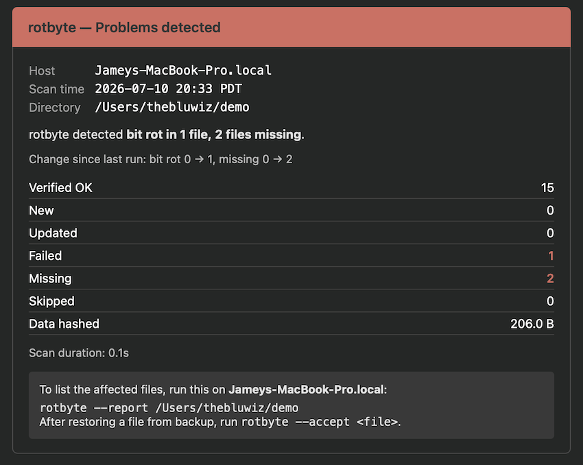

<!-- IMAGE: docs/img/logo.png — wordmark/logo -->


# rotbyte

> Guard your files against silent data corruption.

[](https://pypi.org/project/rotbyte/)
[](https://pypi.org/project/rotbyte/)
[](#requirements)
[](#requirements)
[](LICENSE.md)

Bit rot flips bits without touching timestamps or file sizes. By the time you notice, your backups may have already rotated out the good copy. **rotbyte** keeps a database of checksums and tells you the moment something doesn't match.

Hashes are BLAKE2b-512 — cryptographically strong and faster than SHA-256 on modern CPUs, so full re-verifies stay I/O-bound rather than CPU-bound.

<!-- IMAGE: docs/img/demo-scan.gif — hero live-scan demo; see NEEDED_IMAGES.md -->


## Contents

- [Who it's for](#who-its-for)
- [Why rotbyte](#why-rotbyte)
- [Install](#install)
- [Quick start](#quick-start)
- [Common recipes](#common-recipes)
- [How it compares](#how-it-compares)
- [Features](#features)
- [Catching corruption](#catching-corruption)
- [Scheduling](#scheduling)
- [Notifications](#notifications)
- [Monitoring and automation](#monitoring-and-automation)
- [Incremental verification](#incremental-verification)
- [rotbyte and backups](#rotbyte-and-backups)
- [Recovering from problems](#recovering-from-problems)
- [Exit codes](#exit-codes)
- [All options](#all-options)
- [Known limitations](#known-limitations)
- [Requirements](#requirements)
- [Bugs](#bugs)
- [Uninstall](#uninstall)
- [FAQ](#faq)
- [Changelog](#changelog)
- [License](#license)

## Who it's for

- **Data hoarders** with media libraries on NAS boxes and external drives, who want to know the instant a file rots.
- **Homelabbers and self-hosters** who want scheduled integrity checks with email alerts and machine-readable output for monitoring.
- **Anyone without a checksumming filesystem** (APFS, ext4, NTFS, exFAT — i.e. not ZFS/Btrfs) who still wants end-to-end integrity checks.

It scales from a single directory or a handful of files up to multi-terabyte libraries — small sets finish instantly, and large ones are hashed in parallel, resumably, and within an optional time budget. The sweet spot is media/archive trees (fewer, larger files); see [Known limitations](#known-limitations) for the file-count trade-off.

## Why rotbyte

- **Works on any filesystem** — no ZFS/Btrfs, no special hardware, no parity disks required.
- **Cross-platform** — the same tool on macOS, Linux, and Windows.
- **No third-party dependencies** — rotbyte's code is pure Python standard library, so there's nothing extra to audit, trust, or break (see [Requirements](#requirements)).
- **Never modifies your data** — it only reads your files; the only thing it writes is its own checksum database.
- **Detect + schedule + notify in one tool** — native scheduled scans and email alerts are built in, not bolted on with cron and shell glue.
- **Built to run unattended at scale** — parallel hashing, interrupt-safe resume, time-budgeted incremental verification, and JSON output for monitoring.

## Install

```bash
# Any platform (macOS, Linux, Windows) — recommended
pipx install rotbyte

# macOS via Homebrew — also installs the man page and shell completions
brew install rotbyte
```

`pipx` gives you an isolated, self-updating install on any platform. The Homebrew formula is a thin wrapper that additionally places `rotbyte.1` and shell completions where your shell will find them; pipx users who want completions can copy them out of the [`completions/`](completions/) directory manually.

> **Dependencies:** rotbyte's own code adds no packages — `pip`/`pipx` install nothing beyond rotbyte itself. It does need a Python runtime, though: `pipx` uses the Python you already have, while `brew install` pulls in Homebrew's Python (and its stack — openssl, sqlite, and friends) if you don't already have it.

## Quick start

```bash
# Index every file in the current directory
rotbyte

# Scan a specific drive
rotbyte /Volumes/Media

# Full re-verify — the only way to catch true silent corruption
rotbyte --check

# Integrity report: counts by state, plus every failed and missing file
rotbyte --report
```

On the first run, rotbyte hashes every file in the target directory and stores the results in a `.{dirname}_rotbyte.db` SQLite database inside that directory. Subsequent runs only re-hash files whose size or modification time changed, so they're fast. Pass a path to scan somewhere other than the current directory.

> Databases from rotbyte 1.0 and earlier used the name `.{dirname}_checksums.db`. They are auto-migrated on the first run of any newer version — the DB plus its `.lock`, WAL, SHM, and `.manifest` sidecars are atomically renamed, with all history preserved. You'll see a single `Renamed legacy database to …` notice on stderr when it happens.

## Common recipes

```bash
# Index a drive, then establish a rot-detecting baseline
rotbyte /Volumes/Media
rotbyte --check /Volumes/Media

# Set-and-forget: quick scan hourly, full re-verify nightly at 2 AM
# with a 2-hour budget and an email health report
rotbyte --track --every 1h --full-at 2h --budget 2h --notify email /Volumes/Media

# Re-verify only files not checked in the last 30 days, capped at 1 hour
rotbyte --due 30d --budget 1h /Volumes/Media

# See what's scheduled and how your files are doing
rotbyte --status

# Machine-readable output for a monitoring pipeline
rotbyte --check --json /Volumes/Media
```

## How it compares

rotbyte is a **tripwire**: it *detects* silent corruption, it doesn't repair it. That's a deliberate niche — it needs no special filesystem, no parity, and no extra disks, and it runs the same everywhere.

| | Detects bit rot | Repairs corruption | Any filesystem | macOS / Linux / Windows | Scheduling + alerts built in |
|---|:---:|:---:|:---:|:---:|:---:|
| **rotbyte** | ✅ | ❌ *(tripwire)* | ✅ | ✅ | ✅ |
| ZFS / Btrfs scrub | ✅ | ✅ *(needs redundancy)* | ❌ *(needs that FS)* | partial | via cron |
| SnapRAID | ✅ | ✅ *(parity)* | ✅ | ✅ | via cron |
| par2 | ✅ | ✅ *(parity archives)* | ✅ | ✅ | manual |
| `cshatag` / `bitrot` | ✅ | ❌ | ✅ | partial | via cron |

Reach for rotbyte when you want a cross-platform "did anything change that shouldn't have?" alarm on ordinary filesystems. Pair it with backups, parity (SnapRAID/par2), or a redundant filesystem (ZFS/Btrfs) for the *repair* side — see [rotbyte and backups](#rotbyte-and-backups).

## Features

- **Fast** — parallel hashing across all cores with a live progress bar and throughput stats.
- **Interrupt-safe** — hit Ctrl-C and it finishes the files it's currently hashing, saves progress, and picks up where it left off next time. Hit Ctrl-C a second time to abort immediately.
- **Edit-aware** — a changed hash with changed metadata is an edit, not an alarm. Only silent mismatches trigger a failure.
- **Move detection** — when new files match the checksum of missing files, rotbyte tells you they were probably renamed rather than deleted and re-added.
- **Import-friendly** — already have `.b2sum` sidecar files? `rotbyte --import` pulls them in and cleans up the originals.
- **Cron-ready** — `--quiet` suppresses everything except problems, so you get clean logs.
- **Time-budgeted scans** — `--budget` caps wall-clock time on full re-verifies. Stalest files are checked first, so successive runs cover the entire database.
- **Scheduled scanning** — `--track` installs native launchd (macOS), systemd (Linux), or Task Scheduler (Windows) timers with configurable quick and full scan schedules.
- **Due-based verification** — `--due 30d` targets only files not checked recently, combining naturally with `--budget`.
- **Email notifications** — `--notify email` sends a health report after every full re-verify and an alert when problems are found on quick scans. Works standalone or with `--track`.
- **JSON output** — `--json` produces machine-readable results for scripts and monitoring pipelines.
- **Export** — `--export` writes a b2sum-compatible manifest as an independent backup of your checksums outside the database. Use `--auto-export` to refresh the manifest automatically after every full `--check`.
- **Directory exclusion** — `--exclude` skips directories you don't want tracked.

## Catching corruption

Default scans detect changed files but won't catch bit rot — silent corruption where the data changes without touching the modification time. `--check` re-hashes every file regardless of metadata. A hash change accompanied by a metadata change is treated as an intentional edit; only a hash change with **no** metadata change triggers a `FAILED` record.

After a scan, `--report` prints an integrity report for that directory's database — counts by state, every file in a not-good state (**failed** *and* **missing**), and, when a `--due` window is set (or discovered from the directory's scheduled scan), which files are overdue for re-verification.

<!-- IMAGE: docs/img/report.png — `rotbyte --report` output; see NEEDED_IMAGES.md -->


<!-- IMAGE (optional): docs/img/how-it-works.svg — scan → hash → compare → edit-vs-rot → DB; see NEEDED_IMAGES.md -->

## Scheduling

Instead of writing cron rules by hand, use `--track` to install platform-native scheduled scans:

```bash
# Quick scan every hour, full re-verify daily at 2 AM with a 2-hour budget
rotbyte --track --every 1h --full-at 2h --budget 2h /Volumes/Media

# Quick scan every 30 minutes, full verify twice daily
rotbyte --track --every 30m --full-at 2h 14h /Volumes/Media

# Check what's scheduled and how your files are doing
rotbyte --status
```

<!-- IMAGE: docs/img/status.png — `rotbyte --status` output; see NEEDED_IMAGES.md -->


On macOS this writes launchd plists to `~/Library/LaunchAgents/`. On Linux it writes systemd user timers to `~/.config/systemd/user/`. On Windows it registers Task Scheduler tasks under `\rotbyte\` (user-level, no admin prompt). Running `--track` without `--full-at` installs only the quick scan; add `--full-at` to also schedule a nightly full re-verify. For a guided setup, use `rotbyte --track-setup` — it mirrors `--notify-setup` and walks you through every option.

After a package upgrade (`brew upgrade`), run `rotbyte --repair` once. Scheduled scans bake in an absolute interpreter/script path that an upgrade can delete, silently breaking every run (`--status` shows `BROKEN ✗`); `--repair` re-points and reloads each schedule in place, preserving all flags.

To remove scheduled runs:

```bash
# Stop tracking a single directory (defaults to the current dir if omitted)
rotbyte --untrack /Volumes/Media

# Remove every rotbyte schedule on this machine
rotbyte --untrack-all
```

`--untrack` canonicalises the path the same way `--track` does, so it removes exactly what was installed for that directory. If nothing is installed for the path, rotbyte prints a friendly notice and exits 0. The checksum database is left in place — only the scheduler unit (launchd plist / systemd timer+service / Task Scheduler task) is removed.

To tidy up scheduler logs — for example after an upgrade leaves stale error spam or `--untrack` strands a directory's old log:

```bash
rotbyte --clear-logs
```

On macOS this truncates the live log of each still-installed scan in place (launchd keeps the log file open between runs, so deleting it would leak disk until the next reload) and deletes rotated generations (`.log.1`, `.log.2`) plus any orphaned logs whose schedule is gone. Only macOS keeps rotbyte-owned log files: on Linux the scheduled-scan output lives in the systemd journal (`journalctl --user -u 'rotbyte-*'`) and on Windows in Task Scheduler's history, so on those platforms `--clear-logs` just tells you where to look. Your checksum databases are never touched, and it exits 0 even when there's nothing to clear.

On Windows, scheduled scans skip runs while on battery by default (matching typical Task Scheduler behavior). Pass `--run-on-battery` with `--track` if you want them to run regardless of power state.

> **macOS users:** Scanning TCC-protected directories (Desktop, Documents, Downloads, external drives) with `--track` requires a one-time Full Disk Access grant for Python. Run `rotbyte --grant-fda` to jump straight to the right System Settings pane with the correct binary revealed in Finder, or see [macOS Permissions](docs/macos-permissions.md) (or run `rotbyte --docs permissions`) for the full manual walkthrough.
>
> **Windows users:** If you use Controlled Folder Access, you may need to allow `python.exe` (or whichever interpreter pipx installed rotbyte under) to read your protected directories. See [Windows Task Scheduler](docs/windows-task-scheduler.md) (or run `rotbyte --docs scheduler`) for uninstall and inspection commands.

You can still use cron if you prefer:

```bash
# Sunday 2 AM full verify, only log problems
0 2 * * 0  rotbyte --check -q /Volumes/Media >> /var/log/rotbyte.log 2>&1
```

## Notifications

Get email health reports after full re-verifies and alerts when problems are found. One-time setup:

```bash
rotbyte --notify-setup email
```

This prompts for your SMTP credentials (e.g. Gmail + app password), sends a test email, and saves the config. Then use `--notify email` on any scan:

```bash
# One-off scan with email alert
rotbyte --check --notify email /Volumes/Media

# Bake it into scheduled scans
rotbyte --track --every 1h --full-at 2h --notify email /Volumes/Media
```

<!-- IMAGE: docs/img/email.png — the HTML email health report; see NEEDED_IMAGES.md -->


Full scans (`--check`) always send a health report — whether everything checks out or something needs attention. Quick scans only notify when there's a problem, so your inbox stays clean.

Your SMTP password is stored in the OS credential store — macOS Keychain, Windows Credential Manager, or libsecret on Linux — never in the config file or on a command line. If no credential store is available it falls back to a `chmod 600` config file with a warning (use an app-specific password there, never your primary one).

For provider-specific setup (Gmail, iCloud, Outlook) see [Email Notification Setup](docs/email-notification-setup.md) (or run `rotbyte --docs notify`).

## Monitoring and automation

`--json` emits machine-readable results — counts by state, failed paths, duration, and bytes hashed — for scripts and dashboards:

```bash
rotbyte --check --json /Volumes/Media | jq '{failed, missing, verified_ok}'
```

Wire scheduled runs into whatever you already run: ping [healthchecks.io](https://healthchecks.io), write a Prometheus textfile-exporter metric, feed Uptime Kuma, or drive a Grafana panel. The [exit code](#exit-codes) is the simplest signal of all — alert on anything non-zero.

## Incremental verification

Large archives can't always be fully re-verified in one sitting. Combine `--check` with `--budget` and `--due` to spread the work across multiple runs:

```bash
# Full verify with a 2-hour time limit (stalest files first)
rotbyte --check --budget 2h /Volumes/Media

# Only re-verify files not checked in 30 days, with a 1-hour budget
rotbyte --due 30d --budget 1h /Volumes/Media
```

`--budget` processes the stalest files first, so successive runs gradually cover the entire archive. On a budget or interrupt, rotbyte finishes the files it's currently hashing, commits progress, and stops — the next run picks up where it left off.

## rotbyte and backups

rotbyte is a **tripwire, not a backup**. It tells you *that* a file has rotted; it can't recover the original bytes. Pair it with a real backup strategy (ideally 3-2-1: three copies, two media, one offsite) so that when rotbyte raises an alarm, you have a known-good copy to restore from.

A nice side effect of rotbyte's design: the checksum database is just a file, and `--export` writes a portable b2sum-compatible manifest. Keep a copy of the database (or an exported manifest) on your backup target alongside the data. If the source drive's database is lost or itself corrupted, the backup's copy lets you pick up where you left off — and running rotbyte against the backup gives you an independent integrity check of the backup itself.

### Protecting the database itself

rotbyte's database is one more file on your drive, so the same failure modes that threaten your data can threaten the tripwire. Recommended practices, in order of how much effort they take:

- **Put the database on a different volume than the data.** Use `--db /path/on/another/drive/media.db` (or point it at your backup target). rotbyte prints `DB on separate volume: ✓` at startup when this is the case. If the source drive fails, the database survives.
- **Enable `--auto-export`** on full scans. After every `--check`, rotbyte writes `<db_path>.manifest` — a plain-text, b2sum-compatible copy of all current checksums. It's resilient to SQLite-level problems and trivially diffable:
  ```bash
  rotbyte --check --auto-export /Volumes/Media
  ```
  When combined with `--track`, the flag persists into the scheduled command, so every scheduled full scan refreshes the manifest automatically.
- **Include the database (and manifest) in your backups.** The DB is small relative to what it tracks. Backing it up alongside the data means either copy — source or backup — can bootstrap the other.
- **Let rotbyte catch DB rot itself.** Every invocation runs a `PRAGMA quick_check` against the database before doing anything. A corrupt DB causes rotbyte to exit immediately with code **4** and clear recovery instructions — it will never silently produce misleading results off a damaged tripwire.

## Recovering from problems

```bash
# Accept a single restored file as correct
rotbyte --accept restored_file.mkv

# Accept everything — clears all MISSING and FAILED records
rotbyte --accept-all

# Export checksums as a portable plain-text manifest (MISSING files are excluded)
rotbyte --export checksums.txt
```

## Exit codes

| Code | Meaning |
|------|---------|
| `0` | All files OK |
| `1` | Missing files detected |
| `2` | Bit rot detected |
| `3` | Interrupted (safe to re-run) |
| `4` | Database integrity check failed (restore from backup) |
| `5` | Database locked by another rotbyte process (retry later) |
| `6` | I/O error (target directory unreachable, permission denied) |
| `7` | Internal error (worker pool died, unexpected exception) |

## All options

`rotbyte --help` shows a quick reference. Run `rotbyte --help-all` for the full option list, or `man rotbyte` after installing via Homebrew.

Additional tuning flags available via `--help-all`: `--workers` (parallel hashing workers), `--db` (custom database path), `--skip-missing` (skip missing-file detection), `--include-hidden` (include dotfiles and hidden directories), `--case-insensitive` (normalise file paths to lowercase for macOS APFS / Windows NTFS users who rename by case).

Shell completions for bash, zsh, and fish are in the `completions/` directory.

## Known limitations

- **Hardlinks are hashed once per link.** rotbyte does not dedupe by
  `(st_dev, st_ino)`, so a file present under two names on the same
  volume is hashed twice and stored as two separate rows. This rarely
  matters for the media/archive trees rotbyte targets, but if you have
  a deduplicated backup where many files are hardlinked, the first
  full scan will take roughly `O(paths)` wall time rather than
  `O(unique inodes)`.
- **Very large file counts cost per-file overhead.** rotbyte holds
  per-file state in memory and is roughly `O(paths)`, so a tree of
  *millions of tiny files* uses more memory and time than the same bytes
  in fewer, larger files. Total size isn't the constraint — file count
  is. Media/archive trees are the sweet spot.
- **Case-insensitive filesystems** (macOS APFS by default, Windows NTFS)
  can produce phantom `MISSING` records if a file is renamed only by
  case (`foo.mkv` → `Foo.mkv`) — the database still stores the old
  casing. Pass `--case-insensitive` to opt into lowercase path
  normalisation; note that flipping this flag on an existing database
  will rewrite every tracked path to lower case on the next scan.

## Requirements

Python 3.9+ on macOS, Linux, or Windows. rotbyte's code uses only the Python standard library — there are no third-party packages to install, audit, or break. (See the [dependency note under Install](#install) for what `pipx` vs `brew` actually pull in.)

## Bugs

rotbyte is a solo project — I'm not accepting feature pull requests, but **bug reports are very welcome**. Please open an issue at <https://github.com/TheBluWiz/RotByte/issues> with your OS, the output of `rotbyte --version`, and the exact command you ran.

## Uninstall

```bash
# Homebrew
brew uninstall rotbyte

# pipx
pipx uninstall rotbyte
```

Uninstalling removes the program but leaves your data untouched. For a clean sweep, remove the scheduled scans and their logs **first** (while rotbyte is still installed):

```bash
rotbyte --untrack-all     # remove every scheduled scan
rotbyte --clear-logs      # remove scheduler logs (macOS)
```

Then delete each directory's hidden `.{dirname}_rotbyte.db` database (plus any `.manifest` sidecar) by hand, and the notification config under your config directory (`~/Library/Application Support/rotbyte/` on macOS, `~/.config/rotbyte/` elsewhere) if you set up email.

## FAQ

**Does rotbyte ever modify my files?**
No. It only reads your files to compute checksums. The only things it writes are its own database (the hidden `.{dirname}_rotbyte.db`) and, if you ask for one, an exported manifest.

**How big does the database get?**
Small — on the order of a fraction of a kilobyte per tracked file (a path, a 128-hex-character checksum, and some metadata). A library of hundreds of thousands of files is typically tens of megabytes.

**Is it safe to Ctrl-C mid-scan?**
Yes. It finishes the files it's currently hashing, commits progress, and resumes next run. Press Ctrl-C a second time to abort immediately.

**Does it follow symlinks and handle hardlinks?**
Directory symlinks are not followed (the scan stays inside the target tree). A file symlink that resolves to a regular file is hashed. A hardlinked file is hashed once per name — see [Known limitations](#known-limitations).

**Where are my email credentials stored?**
In your OS credential store (macOS Keychain, Windows Credential Manager, or libsecret on Linux) — never in the config file or on a command line. Without a credential store, they fall back to a `chmod 600` file with a warning.

**Will it work on my NAS or a network drive?**
Yes — that's a primary use case. On network filesystems that don't support SQLite's WAL mode, rotbyte falls back to a fully durable journaling mode, and you can keep the database on a separate volume with `--db`.

## Changelog

See [CHANGELOG.md](CHANGELOG.md) for release history.

## License

[MIT](LICENSE.md)
